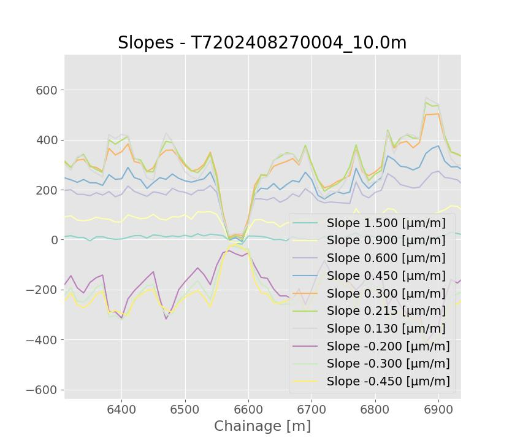

# TSD data set Documentation

## Filenames

filenames consists of,

*VID YYYYMMDD NNNN _ INT . csv*

Where,

VID: is the vehicle identification number

YYYYMMDD: year,month,day date code .

NNNN: Measurement number on the day

INT: Reporting interval.

## Sections

The dateset contains two sections, *Section1* and *Section3*, from a measurement loop in Denmark that Greenwood often measures. 
*Section1* is a country road with some variation in the roads response, ie. some softer and some stiffer parts. *Section3 is part of a highway and has generally a quite low response

## Repeats

If files have the same date code, but different *NNNN* number, there are repeats of the same section on the same day.


## Features

Some times one can experience all slopes going to very low values, like in the image below.



This is due to passing over a bridge. 


## Reading and working with data

The files can be imported into excel or read into python for further analysis. **They can also be uploaded to the ViscBackCalc webservice.???**

In python the files are easily read with the library called Pandas,

```
import pandas as pd
df = pd.read_csv("PATH/TO/FILE/FILENAME")
```

In these exports SCI_TSD was not exported but it can be calculated very easily:

```
df['SCITSD'] = (df['Slope 0.130 [µm/m]'] - df['Slope -0.200 [µm/m]'])*(0.33/2)
```